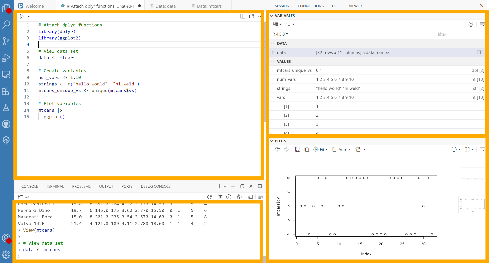

# Positron IDE setup
Erika Duan
Invalid Date

- [Integrated Development
  Environments](#integrated-development-environments)
- [Choosing Positron as an IDE](#choosing-positron-as-an-ide)
- [Positron Windows setup](#positron-windows-setup)
- [Linting using `air`](#linting-using-air)
- [Positron versus RStudio usage
  differences](#positron-versus-rstudio-usage-differences)
- [Access to GitHub co-pilot and other LLM
  tools](#access-to-github-co-pilot-and-other-llm-tools)
- [Other resources](#other-resources)

# Integrated Development Environments

An Integrated Development Environment (IDE) is simply a software
application that supports code development. Different IDEs are popular
for different languages:

- R programmers tend to use
  [RStudio](https://posit.co/download/rstudio-desktop/).  
- Cloud platform constrained Python programmers tend to use a
  proprietary variation of [JupyterLabs](https://jupyter.org/).  
- Programmers switching between R, Python, Julia or other programming
  languages tend to use [Visual Studio
  Code](https://code.visualstudio.com/).

The RStudio IDE is thoughtfully designed to support data exploration and
R code development. If you mostly program in R, I recommend staying with
the [RStudio IDE](https://posit.co/download/rstudio-desktop/) and
skipping this tutorial.

# Choosing Positron as an IDE

If you are a data scientist who loves R programming (and the RStudio
experience) but more frequently programs in Python or Julia, then
[Positron](https://positron.posit.co/start.html) may be an appealing IDE
compared to [Visual Studio Code](https://code.visualstudio.com/).

The core features of Positron are:

- It is built on the [open source
  version](https://github.com/microsoft/vscode) of Visual Studio Code
  (so it aesthetically resembles Visual Studio Code).  

- It also supports Visual Studio extensions. As Microsoft does not
  permit access to Visual Studio Marketplace for non-Microsoft Visual
  Studio builds, Positron’s Visual Studio extensions are hosted by [Open
  VSX](https://open-vsx.org/).  

- Provides ***variables*** and ***plots*** panes for each R session, and
  ***connections*** and ***help*** panes similar to RStudio.  

- Provides an R console directly beneath R scripts and notebooks similar
  to RStudio.  

- Provides IDE layout customisation such as the original 4 panel RStudio
  layout (with 1. script, 2. console, 3. environment and 4.
  plots/help/viewer panes).

  

# Positron Windows setup

My simple R-user-friendly Windows setup only involves several steps.
These are listed in the Migrating from RStudio to Positron walkthrough.

1.  Download the [Positron IDE](https://positron.posit.co/download.html)
    onto your desktop.

    

2.  Import [RStudio
    keybindings](https://positron.posit.co/rstudio-keybindings.html) by
    navigating to ***File*** \> ***Preferences*** \> ***Settings***,
    searching for `workbench.keybindings.rstudioKeybindings` and
    clicking the ***enable*** checkbox. Restart Positron for the
    settings to take effect.

    Examples of RStudio keybindings that I use are `Ctrl` + `Alt` + `I`
    to insert a new R markdown cell and `Ctrl` + `I` to re-indent
    selected code.

3.  Opt-in to use `air`.

# Linting using `air`

We recommend that you opt in to using Air to format every time you save
a file; you’ll benefit from consistent formatting across your code,
including adding final newlines and more.

https://www.tidyverse.org/blog/2025/02/air/

# Positron versus RStudio usage differences

https://positron.posit.co/rstudio-rproj-file.html

# Access to GitHub co-pilot and other LLM tools

# Other resources

- https://www.andrewheiss.com/blog/2025/07/05/positron-ssh-docker/  
- https://www.andrewheiss.com/blog/2024/07/08/fun-with-positron/  
- https://www.emilyriederer.com/post/py-rgo-2025/
